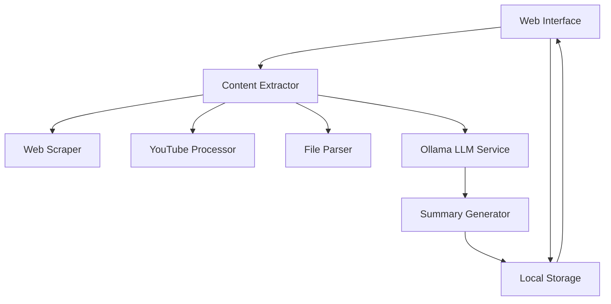

# Design Document

## Overview

SAWRON is a client-side web application that processes various content types through a local LLM to generate comprehensive knowledge summaries. The architecture consists of a frontend web interface, content extraction services, local LLM integration via Ollama, and browser-based storage. The application runs entirely locally without external dependencies after initial setup.

## Architecture

### High-Level Architecture



### Technology Stack

- **Frontend**: Vanilla JavaScript/HTML/CSS or lightweight framework (React/Vue)
- **Local Server**: Node.js with Express for localhost serving
- **LLM Integration**: Ollama REST API (Phi4-mini model)
- **Storage**: IndexedDB for browser-based persistence
- **Content Extraction**: 
  - Web scraping: Puppeteer or Playwright
  - YouTube: YouTube Transcript API or yt-dlp
  - File parsing: PDF.js, mammoth.js for DOCX, built-in for TXT

## Components and Interfaces

### 1. Web Interface Component

**Purpose**: Provides user interaction layer for content input and summary management

**Key Features**:
- Input forms for URLs, file uploads, and playlist URLs
- Progress indicators for processing status
- Summary display and management interface
- Search and filter capabilities for stored summaries

**Interface**:
```javascript
interface WebInterface {
  renderInputForm(): void
  displayProgress(status: ProcessingStatus): void
  showSummaries(summaries: Summary[]): void
  handleUserInput(input: ContentInput): void
}
```

### 2. Content Extractor Service

**Purpose**: Orchestrates content extraction from various sources

**Key Features**:
- Route content to appropriate extraction method
- Handle different content types uniformly
- Manage extraction errors and retries

**Interface**:
```javascript
interface ContentExtractor {
  extractFromUrl(url: string): Promise<ExtractedContent>
  extractFromFile(file: File): Promise<ExtractedContent>
  extractFromPlaylist(playlistUrl: string): Promise<ExtractedContent[]>
}
```

### 3. Web Scraper Module

**Purpose**: Extract text content from web pages

**Implementation Approach**:
- Use Puppeteer in headless mode for JavaScript-heavy sites
- Implement content cleaning to remove navigation, ads, and irrelevant elements
- Handle different website structures with fallback strategies

**Interface**:
```javascript
interface WebScraper {
  scrapeUrl(url: string): Promise<ScrapedContent>
  cleanContent(rawHtml: string): string
  validateUrl(url: string): boolean
}
```

### 4. YouTube Processor Module

**Purpose**: Extract transcripts from YouTube videos and playlists

**Implementation Approach**:
- Use YouTube Transcript API for transcript extraction
- Handle playlist expansion to individual video URLs
- Manage rate limiting and API errors gracefully

**Interface**:
```javascript
interface YouTubeProcessor {
  getVideoTranscript(videoId: string): Promise<Transcript>
  getPlaylistVideos(playlistId: string): Promise<string[]>
  extractVideoId(url: string): string
}
```

### 5. File Parser Module

**Purpose**: Extract text content from uploaded files

**Implementation Approach**:
- PDF parsing using PDF.js for client-side processing
- DOCX parsing using mammoth.js
- TXT files processed directly
- Handle large files with streaming where possible

**Interface**:
```javascript
interface FileParser {
  parsePdf(file: File): Promise<string>
  parseDocx(file: File): Promise<string>
  parseTxt(file: File): Promise<string>
  getSupportedTypes(): string[]
}
```

### 6. Ollama LLM Service

**Purpose**: Interface with local Ollama instance for content summarization

**Implementation Approach**:
- REST API calls to Ollama endpoint (typically http://localhost:11434)
- Use Phi4-mini model with custom prompt template
- Handle connection errors and model availability
- Implement retry logic for failed requests

**Interface**:
```javascript
interface OllamaService {
  generateSummary(content: string): Promise<Summary>
  checkModelAvailability(): Promise<boolean>
  formatPrompt(content: string): string
}
```

### 7. Local Storage Service

**Purpose**: Persist summaries and metadata in browser storage

**Implementation Approach**:
- Use IndexedDB for structured data storage
- Implement search indexing for quick retrieval
- Handle storage quotas and cleanup strategies

**Interface**:
```javascript
interface StorageService {
  saveSummary(summary: Summary): Promise<void>
  getSummaries(filters?: FilterOptions): Promise<Summary[]>
  searchSummaries(query: string): Promise<Summary[]>
  deleteSummary(id: string): Promise<void>
}
```

## Data Models

### Core Data Types

```typescript
interface Summary {
  id: string
  title: string
  content: string
  source: ContentSource
  metadata: SummaryMetadata
  createdAt: Date
  tags?: string[]
}

interface ContentSource {
  type: 'url' | 'youtube' | 'playlist' | 'file'
  originalUrl?: string
  filename?: string
  videoTitle?: string
}

interface SummaryMetadata {
  wordCount: number
  processingTime: number
  sourceLength: number
  extractionMethod: string
}

interface ProcessingStatus {
  stage: 'extracting' | 'processing' | 'saving' | 'complete' | 'error'
  progress: number
  message: string
  currentItem?: string
}
```

## Error Handling

### Error Categories and Strategies

1. **Content Extraction Errors**
   - Network timeouts: Retry with exponential backoff
   - Invalid URLs: Validate and provide user feedback
   - Protected content: Inform user of limitations

2. **LLM Processing Errors**
   - Ollama unavailable: Check service status and guide user
   - Model not found: Provide model installation instructions
   - Content too large: Implement chunking strategy

3. **Storage Errors**
   - Quota exceeded: Implement cleanup suggestions
   - IndexedDB unavailable: Fallback to localStorage with limitations

4. **File Processing Errors**
   - Unsupported formats: Clear error messages with supported types
   - Corrupted files: Graceful handling with user notification
   - Large files: Progress indicators and memory management

### Error Recovery Mechanisms

- Automatic retry for transient network errors
- Graceful degradation when optional features fail
- Clear user guidance for configuration issues
- Partial success handling for batch operations (playlists)

## Testing Strategy

### Unit Testing
- Individual component testing for each service module
- Mock external dependencies (Ollama, file system)
- Test error handling and edge cases
- Validate data transformation accuracy

### Integration Testing
- End-to-end content processing workflows
- Ollama integration with actual model responses
- Storage persistence across browser sessions
- Cross-browser compatibility testing

### Performance Testing
- Large file processing capabilities
- Memory usage during batch playlist processing
- Storage efficiency and retrieval speed
- Concurrent processing limitations

### User Acceptance Testing
- Real-world content processing scenarios
- Interface usability and responsiveness
- Error message clarity and helpfulness
- Summary quality validation with actual content

## Security Considerations

### Local-First Security
- No external data transmission (privacy by design)
- File upload validation to prevent malicious content
- URL validation to prevent SSRF attacks
- Content sanitization before LLM processing

### Browser Security
- CSP headers to prevent XSS
- Secure handling of user-uploaded files
- Storage encryption for sensitive summaries (optional)
- Rate limiting for resource-intensive operations